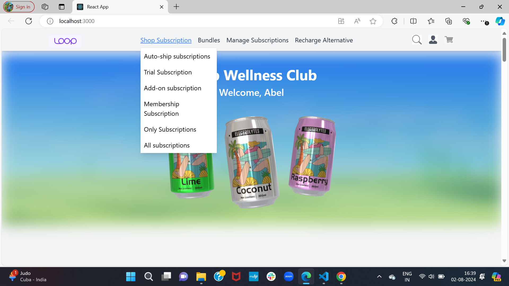
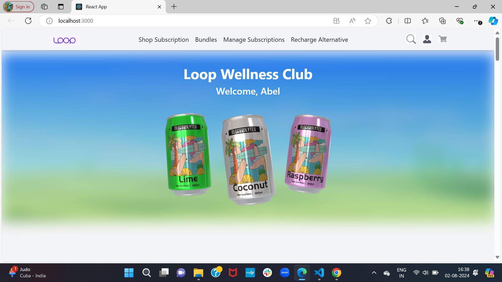
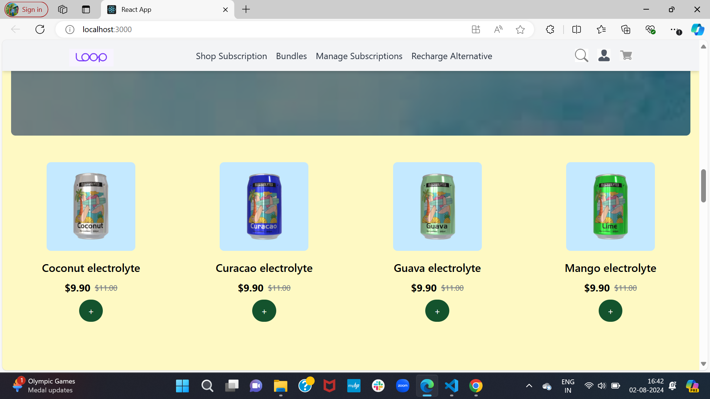
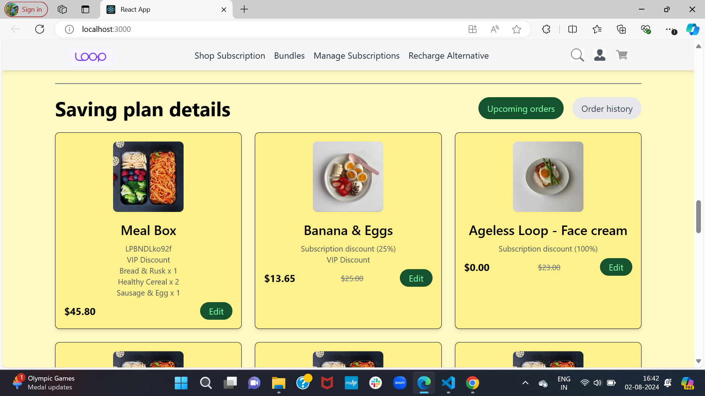
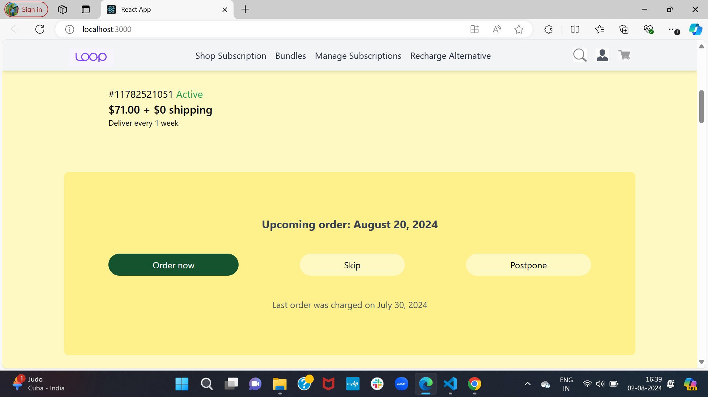
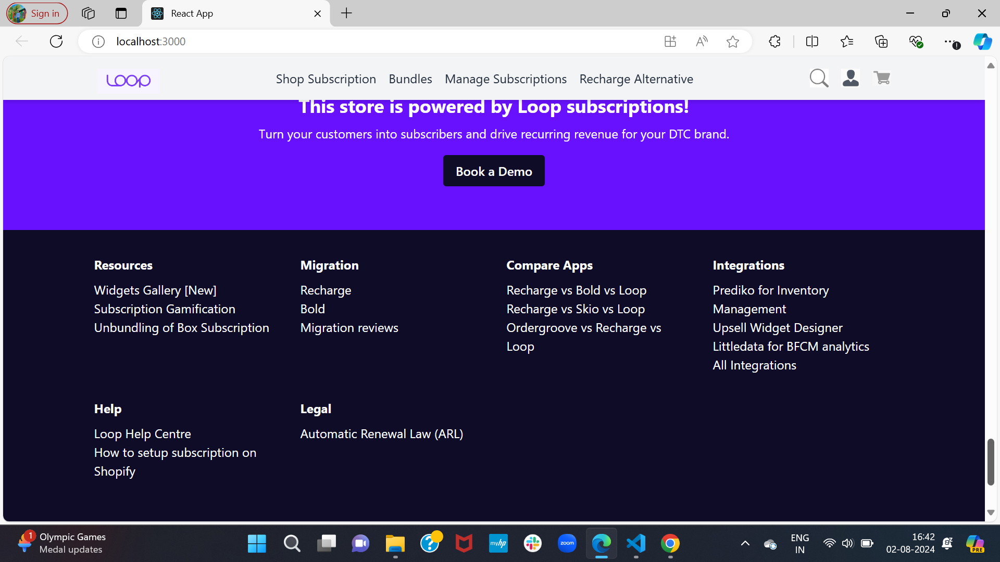

# Loop Subscription App Subscription Page

This project is the front-end code for the subscription page of the Loop Subscription App. It is built with React and Tailwind CSS to create a responsive and user-friendly interface.

## Overview

The subscription page allows users to manage their subscriptions, view upcoming orders, and access various subscription-related features. The page consists of several key components: Navbar, Hero, Body, and Footer.

## Components

### Navbar
The `Navbar` component provides navigation options for the users. It includes dropdown menus for "Shop Subscription" and "Bundles" along with buttons for "Manage Subscriptions", "Recharge Alternative", search, login, and cart functionalities.

### Hero
The `Hero` component displays a welcoming message with a background image and a highlighted product image. It aims to provide an engaging introduction to the subscription services.

### Body
The `Body` component displays detailed information about the user's active subscription, including the subscription ID, status, cost, delivery frequency, and upcoming order details. Users can also take actions like ordering now, skipping, or postponing their next delivery.

### Product
The `Product` component highlights the featured products available through the subscription service. It includes product images, descriptions, and pricing information.

### Saving Plan
The `Saving Plan` component provides details about the various subscription plans available to users. It includes information on the cost savings associated with each plan, encouraging users to choose the most cost-effective option.

### Bonus Offer
The `Bonus Offer` component outlines the special bonuses and offers available to subscribers. This includes discounts on orders, free consultations, and other exclusive perks.

### Footer
The `Footer` component provides additional navigation links and resources, including sections for resources, migration, app comparisons, integrations, help, and legal information. It also includes a button to follow on the shop and options to select the country/region and language.

## Features

- **Responsive Design:** The page is fully responsive and adapts to various screen sizes, including desktop, tablet, and mobile.
- **User-Friendly Navigation:** The navbar includes dropdown menus for easy access to different subscription categories.
- **Subscription Management:** Users can view and manage their subscriptions, including actions like ordering now, skipping, or postponing deliveries.
- **Engaging UI:** The hero section provides a visually appealing introduction to the subscription service.

## Deployment

The live version of this project is deployed on Vercel. You can access the application through the following link:

**Deploy Link**: (loop-react-assign-6e0sxqczf-kaushals-projects-9652eed7.vercel.app)

Feel free to explore the features of this project. If you encounter any issues or have any feedback, you can use the "Feedback" page to share your thoughts with us.

Thank you for using ! We hope you have a wonderful experience using our platform. If you have any questions or need assistance, please don't hesitate to contact our support team.

Thanks! 🌉
